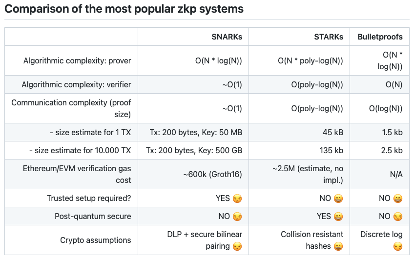
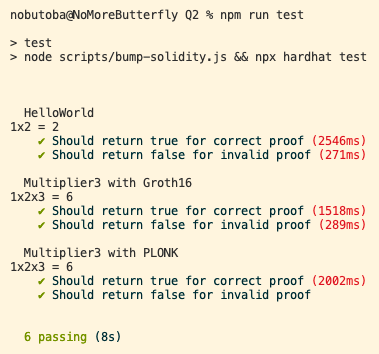
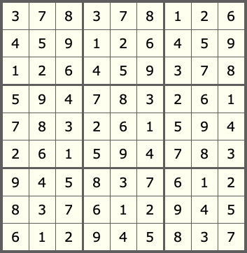

# Week 1 Assignment

1. Enrolled email address: tba
1. Discord handle (e.g. cs#6500): tba

## Part 1. Theoretical background of [zk-SNARKs and zk-STARKS](https://consensys.net/blog/blockchain-explained/zero-knowledge-proofs-starks-vs-snarks/)

### Part 1 Q1

> Write down two types of SNARK proofs.

1. Groth16
2. PLONK

### Part 1 Q2

> Explain in 2-4 sentences why SNARK requires a trusted setup while STARK doesn’t.

SNARKs require a trusted setup in order to achieve the zero-knowledge property,
as pointed out in the
[original work](https://dl.acm.org/doi/abs/10.1145/2090236.2090263)
that introduced zk-SNARK:
*"Recall that SNARKs do not require any set-up assumptions (i.e., are in the plain model). However, now that we seek the additional property of zero-knowledge, we cannot proceed in the plain model because otherwise we would obtain a two-message zero-knowledge protocol in the plain model, which is impossible"* (p.38).
On the other hand,
STARKs rely on [publicly verifiable randomness](https://docs.ethhub.io/ethereum-roadmap/layer-2-scaling/zk-starks/),
eliminating the need for a trusted setup.

### Part 1 Q3

> Name two more differences between SNARK and STARK proofs.

1. STARK is said to be quantum-resistant while SNARK is not.
2. STARK is more computationally expensive than SNARK.



Reference: [Matter Labs](https://github.com/matter-labs/awesome-zero-knowledge-proofs#comparison-of-the-most-popular-zkp-systems)

## Part 2. Getting started with circom and snarkjs

### Part 2 Q1

> Follow the instructions on [Circom 2 Documentation](https://docs.circom.io/getting-started/installation/) to install circom (2.0.3 or above) and snarkjs (0.4.16 or above) on your machine (Windows users are recommended to install via WSL). Read through the rest of the documentation to learn about the syntax of the circom language. You might also find this [tutorial](https://github.com/enricobottazzi/ZKverse) useful.

### Part 2 Q2

> Fork the `Week 1` repo and go into the `Q2` directory. Install all the node dependencies. In the `contracts/circuits` folder, you will find `HelloWorld.circom`. Run the bash script `scripts/compile-HelloWorld.sh` to compile the circuit. Answer the following questions (word answers should go into the PDF file):

The output of the `npm install` command run in the `Q2` directory was recorded on the log file [`npm-install.log`](./Q2/log/npm-install.log) as follows.

```bash
cd Q2
mkdir log
npm install 2>&1 | tee log/npm-install.log
cd -
```

The output of the `compile-HelloWorld.sh` script was recorded on the log file [`compile-HelloWorld.log`](./Q2/log/compile-HelloWorld.log) as follows.

```bash
cd Q2
bash scripts/compile-HelloWorld.sh 2>&1 | tee log/compile-HelloWorld.log
cd -
```

#### Part 2 Q2.1

> What does the circuit in `HelloWorld.circom` do?

The circuit in
[`HelloWorld.circom`](./Q2/contracts/circuits/HelloWorld.circom)
is an instance of the `Multiplier2` template.

- It takes two input signals `a` and `b`,
which are elements of the finite field `F_p = Z/pZ`.
Here, p is a large prime number which can be written as a 254-bit unsigned integer.
- It outputs their product `a * b`,
which is also an element of `F_p`.
- In short, **the circuit in
[`HelloWorld.circom`](./Q2/contracts/circuits/HelloWorld.circom) performs multiplication modulo a large prime p**.

#### Part 2 Q2.2

> Lines 7-12 of `compile-HelloWorld.sh` download a file called `powersOfTau28_hez_final_10.ptau` for Phase 1 trusted setup. Read more about how this is generated [here](https://blog.hermez.io/hermez-cryptographic-setup/). What is a Powers of Tau ceremony? Explain why this is important in the setup of zk-SNARK applications.

#### Part 2 Q2.3

> Line 24 of `compile-HelloWorld.sh` makes a random entropy contribution as a Phase 2 trusted setup. How are Phase 1 and Phase 2 trusted setup ceremonies different from each other?

### Part 2 Q3

> In this question, you will learn about an important restriction on circom circuits:

#### Part 2 Q3.1

> In the empty `scripts/compile-Multiplier3-groth16.sh`, create a script to compile `contracts/circuits/Multiplier3.circom` and create a verifier contract modeling after `compile-HelloWorld.sh`.

To obtain
[`compile-Multiplier3-groth16.sh`](./Q2/scripts/compile-Multiplier3-groth16.sh),
it suffices to replace all occurrencies of the phrase `HelloWorld` in
[`compile-HelloWorld.sh`](./Q2/scripts/compile-HelloWorld.sh)
with `Multiplier3`.

#### Part 2 Q3.2

> Try to run `compile-Multiplier3-groth16.sh`. You should encounter an error with the circuit as is. Explain what the error means and how it arises.

The output of the
[`compile-Multiplier3-groth16.sh`](./Q2/scripts/compile-Multiplier3-groth16.sh)
script was recorded on the log file [`compile-Multiplier3-groth16.log`](./Q2/log/compile-Multiplier3-groth16.log) as follows.

```bash
cd Q2
bash scripts/compile-Multiplier3-groth16.sh 2>&1 | tee log/compile-Multiplier3-groth16.log
cd -
```

The following error arises when compiling [`Multiplier3.circom`](./Q2/contracts/circuits/Multiplier3-naive.circom).

```text
error[T3001]: Non quadratic constraints are not allowed!
   ┌─ "Multiplier3.circom":14:4
   │
14 │    d <== a * b * c;
   │    ^^^^^^^^^^^^^^^ found here
   │
   = call trace:
     ->Multiplier3
```

This error message is well explained in the
[Circom Documentation](https://docs.circom.io/circom-language/constraint-generation/),
which says
*"Only quadratic expressions are allowed to be included in constraints. Other arithmetic expressions beyond quadratic or using other arithmetic operators like division or power are not allowed as constraints."*

In a nutshell, the above is a compile-time error which kindly reminds us the following.

- Circom only allows rank-1 constraint systems
([R1CS](https://docs.circom.io/background/background/#rank-1-constraint-system)).
- Hence, the cubic constraint `d === a * b * c` in the naive implementation of
[`Multiplier3.circom`](./Q2/contracts/circuits/Multiplier3-naive.circom) is not allowed.

#### Part 2 Q3.3

> Modify `Multiplier3.circom` to perform a multiplication of three input signals under the restrictions of circom.

To check if the modified circom source code
[`Multiplier3.circom`](./Q2/contracts/circuits/Multiplier3.circom)
works,
I ran the same shell script
[`compile-Multiplier3-groth16.sh`](./Q2/scripts/compile-Multiplier3-groth16.sh)
again as follows.

```bash
cd Q2
bash scripts/compile-Multiplier3-groth16.sh 2>&1 | tee log/compile-Multiplier3-groth16-retry.log
cd -
```

The output was recorded on the log file
[`compile-Multiplier3-groth16-retry.log`](./Q2/log/compile-Multiplier3-groth16-retry.log),
which shows that the modification is successful.

Note that the example of a 3-input multiplier can also be found at the
[Circom Documentation](https://docs.circom.io/more-circuits/more-basic-circuits/#extending-our-multiplier-to-three-inputs).

### Part 2 Q4

> In the empty `scripts/compile-Multipler3-plonk.sh`, create a script to compile `circuit/Multiplier3.circom` using PLONK in snarkjs. Add a `_plonk` prefix to the build folder and the output contract to distinguish the two sets of output.

#### Part 2 Q4.1

> You will encounter an error if you just change `snarkjs groth16 setup` to `snarkjs plonk setup`. Resolve this error and answer the following question - How is the process of compiling with PLONK different from compiling with Groth16?

The output of the
[`compile-Multiplier3-plonk.sh`](./Q2/scripts/compile-Multiplier3-plonk-naive.sh)
script was recorded on the log file [`compile-Multiplier3-plonk.log`](./Q2/log/compile-Multiplier3-plonk.log) as follows:

```bash
cd Q2
bash scripts/compile-Multiplier3-plonk.sh 2>&1 | tee log/compile-Multiplier3-plonk.log
cd -
```

The following error arises
when the command `snarkjs zkey contribute ...` is executed:

```text
[ERROR] snarkJS: Error: zkey file is not groth16
```

This is because **Groth16 requires a ceremony
(corresponding to the `snarkjs zkey contribute` phase) for each circuit,
while PLONK does not need such a circuit-dependent setup**.
To resolve the error,
we only have to skip the `snarkjs zkey contribute` phase,
as explained in the
[SnarkJS Documentation](https://github.com/iden3/snarkjs/tree/v0.4.16#15-setup),
and directly generates `circuit_final.zkey` in the `snarkjs plonk setup` phase.

I then ran the modified version of the script
[`compile-Multiplier3-plonk.sh`](./Q2/scripts/compile-Multiplier3-plonk.sh)
as follows.

```bash
cd Q2
bash scripts/compile-Multiplier3-plonk.sh 2>&1 | tee log/compile-Multiplier3-plonk-retry.log
cd -
```

The output was recorded on the log file
[`compile-Multiplier3-plonk-retry.log`](./Q2/log/compile-Multiplier3-plonk-retry.log),
which shows that the modification is successful.

#### Part 2 Q4.2

> What are the practical differences between Groth16 and PLONK? Hint: compare and contrast the resulted contracts and running time of unit tests (see Q5 below) from the two protocols.

### Part 2 Q5

> So far we have not tested our circuit yet. While you can verify your circuit in the terminal using `snarkjs groth16 fullprove`, you can also do so directly in a Node.js script. We will practice doing so by creating some unit tests to try out our verifier contract(s):

#### Part 2 Q5.1

> Running `npx hardhat test` will prompt an error. Before we can test our verifier contracts with hardhat, we must modify the solidity version. In `scripts/bump-solidity.js`, we have already written the regular expressions to modify `HelloWorldVerifier.sol`. Add script to `bump-solidity.js` to do the same for your new contract for `Multiplier3`.

Local link: [`bump-solidity.js`](./Q2/scripts/bump-solidity.js)

#### Part 2 Q5.2

> You can now perform the unit tests for `HelloWorldVerifier` by running `npm run test`. Add inline comments to explain what each line in the test `Should return true for correct proof` is doing.

Local link: [test.js](./Q2/test/test.js)

#### Part 2 Q5.3

> In `test/test.js`, add the unit tests for `Multipler3` for both the Groth16 and PLONK versions. Include a screenshot of all the tests (for `HelloWorld`, `Multiplier3 with Groth16`, and `Multipler3 with PLONK`) passing in your PDF file.

Local link: [test.js](./Q2/test/test.js)

Screen shot:



## Part 3. Reading and designing circuits with circom

> Though it will be nice if we write entirely innovative circuits for every project we create, we should also utilize existing circuit libraries to help us. In this question, you will be learning about two such libraries that you can import to create more complicated circuits. To start, go into the `Q3` directory in `Week 1` repo and run `npm install` in each project folder to install the dependencies.

The output of the `npm install` command run in the `Q3` directory was recorded on the log file [`npm-install.log`](./Q3/log/npm-install.log) as follows.

```bash
cd Q3
mkdir log
npm install 2>&1 | tee log/npm-install.log
cd -
```

### Part 3 Q1

> [circomlib](https://github.com/iden3/circomlib) is the official library of circuit templates released by iden3, the creator of Circom. One important template included is `comparators.circom`, which implements value comparisons between two numbers. The following questions will cover the use of this template in our own circuits:

#### Part 3 Q1.1

> `contracts/circuits/LessThan10.circom` implements a circuit that verifies an input is less than 10 using the `LessThan` template. Study how the template is used in this circuit. What does the 32 in Line 9 stand for?

The 32 in Line 9 stands for the number of bits needed to represent the input signal `in` of the `LessThan10` template as an unsigned integer.
In effect, the `LessThan10` template expects an input signal to lie within the range
`[0, 1, ..., 2**32 - 1]`.

#### Part 3 Q1.2

> What are the possible outputs for the `LessThan` template and what do they mean respectively? (If you cannot figure this out by reading the code alone, feel free to compile the circuit and test with different input values.)

The source code of the
[`LessThan`](https://github.com/iden3/circomlib/blob/v2.0.3/circuits/comparators.circom#L89-L99)
template defined in `comparators.circom` is the following.

```circom
template LessThan(n) {
    assert(n <= 252);
    signal input in[2];
    signal output out;

    component n2b = Num2Bits(n+1);

    n2b.in <== in[0]+ (1<<n) - in[1];

    out <== 1-n2b.out[n];
}
```

Here, the
[`Num2Bits`](https://github.com/iden3/circomlib/blob/v2.0.3/circuits/bitify.circom#L25-L39)
template defined in `bitify.circom`
takes as input a single signal `in`, represented by a nonnegative integer,
and outputs the `n`-bit representation `out[n]` of it,
where `n` is the parameter of the template as in `Num2Bits(n)`.
For example:

1.
    If the input is `7`, then `Num2Bits(n=4)` outputs `[1, 1, 1, 0]`, which is an array of length `n=4`.
1.
    If the input is `23`, then `Num2Bits(n=4)` also outputs `[1, 1, 1, 0]`.
    On the other hand, given the same input, `Num2Bits(n=5)` outputs `[1, 1, 1, 0, 1]`.

The
[`LessThan`](https://github.com/iden3/circomlib/blob/v2.0.3/circuits/comparators.circom#L89-L99)
template implicitly assumes that
both inputs `in[0]` and `in[1]` are
unsigned integers which can be represented by `n` bits.
Under this assumption,
the expression `in[0]+ (1<<n) - in[1]` evaluates to an `(n+1)`-bit unsigned integer
whose most significant bit,
which is essentially `n2b.out[n]`,
is equal to

- `1` if `in[0] - in[1] >= 0`,
- `0` if `in[0] - in[1] < 0`.

The output signal `out` of the `LessThan` template thus satisfies

- `out = 1` if `in[0] < in[1]`,
- `out = 0` if `in[0] >= in[1]`.

Therefore,
informally speaking,
**the
[`LessThan`](https://github.com/iden3/circomlib/blob/v2.0.3/circuits/comparators.circom#L89-L99)
template takes two input signals `in[0]` and `in[1]` and outputs
the conditional expression `out = in[0] < in[1]`.**

Lastly, I'd like to demystify the assertion statement
`assert(n <= 252)`
in the
[`LessThan`](https://github.com/iden3/circomlib/blob/v2.0.3/circuits/comparators.circom#L89-L99)
template.
Recall that signals in Circom are elements of the finite field `F_p = Z/pZ` where

```text
p = 1888242871839275222246405745257275088548364400416034343698204186575808495617
```

is a large prime.
Therefore, **strictly speaking,
it is impossible to compare the magnitude of two signals** in the first place;
in mathematical terms, the order relation on the integers `Z`
does not decend to the quotient set `Z/pZ`.
For example,
the signal 0 is equivalent to the signal p,
so we cannot say 0 is less than 1
when both 0 and 1 are regarded as field elements.
However, **it still makes sense to compare two signals
after representing both of them as integers from 0 to p - 1, inclusive**.
This type of comparison is what the
[`LessThan`](https://github.com/iden3/circomlib/blob/v2.0.3/circuits/comparators.circom#L89-L99)
template aims to do.
Since the binary representation

```text
p = 0b10000101100101101010010010010111101111111110111010010111111101010011000011011011100010111101011000010110111000001010110101000111001010010001001110001100101100101101000111101010000100100010100001111100001111101011001001111110000000000000000000000000001
```

of the large prime p has length 254,
if both input signals `in[0]` and `in[1]`,
represented as integers within the range [0, ..., p-1],
have at most n=252 bits,
then the expression
`in[0]+ (1<<n) - in[1]`
evaluates to a signal that has a representation with at most 253 bits.
In particular, `in[0]+ (1<<n) - in[1]` lies within the range [0, ..., p-1],
and "overflow mod p" never occurs.
This is how the assertion statement
`assert(n <= 252)`
arises.

#### Part 3 Q1.3

> Proving a number is within a range without revealing the actual number could be useful in applications like proving our income when applying for a credit card. In `contracts/circuits/RangeProof.circom`, create a template (not circuit, so don’t add `component main = ...`) that uses `GreaterEqThan` and `LessEqThan` to perform a range proof.

Local link: [`RangeProof.circom`](./Q3/contracts/circuits/RangeProof.circom)

### Part 3 Q2

> [circomlib-matrix](https://github.com/socathie/circomlib-matrix) is a library covering basic matrix operations, modeled after circomlib, and created by our very own mentor Cathie. Matrix operations can be useful in puzzles (e.g. [zkPuzzles](https://github.com/socathie/zkPuzzles), [zkGames](https://github.com/vplasencia/zkGames)), image processing (e.g [zkPhoto](https://github.com/socathie/zkPhoto)), and machine learning (e.g. [zk-mnist](https://github.com/0xZKML/zk-mnist), [zk-ml](https://github.com/zk-ml/demo)). Let’s take a look at matrix operations in action in a [Sudoku](https://en.wikipedia.org/wiki/Sudoku) circuit in the [zkPuzzles](https://github.com/socathie/zkPuzzles) repo.

The output of the `npm install` command run in the `zkPuzzles` directory was recorded on the log file [`npm-install-zkPuzzles.log`](./Q3/log/npm-install-zkPuzzles.log) as follows.

```bash
cd Q3/projects/zkPuzzles
npm install 2>&1 | tee ../../log/npm-install-zkPuzzles.log
cd -
```

#### Part 3 Q2.1

> In `projects/zkPuzzles/circuits`, modify Lines 20-23 of `sudoku.circom` so that it implements the check on the inputs to be between 0 and 9 (inclusive) using your `RangeProof` template from 1.3.

Local link to the final result (see Q2.3): [`sudokuModified.circom`](./Q3/contracts/circuits/sudokuModified.circom)

#### Part 3 Q2.2

> You can run `npm run test:fullProof` while inside the `zkPuzzles` directory to test your modified circuit. You are expected to encounter an error. Record the error, resolve it by modifying `project/zkPuzzles/scripts/compile-circuits.sh`, and explain why it has occurred and what you did to solve the error.

The output of the `npm run test:fullProof` command run in the `zkPuzzles` directory was recorded on the log file [`test-zkPuzzles.log`](./Q3/log/test-zkPuzzles.log) as follows.

```bash
cd Q3/projects/zkPuzzles
npm run test:fullProof 2>&1 | tee ../../log/test-zkPuzzles.log
cd -
```

The error messages are essentially the following.

```text
[ERROR] snarkJS: circuit too big for this power of tau ceremony. 112654 > 2**16
[ERROR] snarkJS: Error: build/sudoku/circuit_final.zkey: Invalid File format
[ERROR] snarkJS: Error: build/sudoku/circuit_final.zkey: Invalid File format
```

Since `112654 = 0b11011100000001110`, we need at least 17 bits to represent it.
Therefore, the power, 16,
for the powers-of-tau file `powersOfTau28_hez_final_16.ptau` hard-coded in [`compile-circuits.sh`](./Q3/projects/zkPuzzles/scripts/compile-circuits.sh)
is not large enough for our purpose.

After replacing all five occurrencies of the phrase `powersOfTau28_hez_final_16`
with `powersOfTau28_hez_final_17` in the
[`compile-circuits.sh`](./Q3/projects/zkPuzzles/scripts/compile-circuits.sh)
script,
I then tried the `npm run test:fullProof` command again as follows.

```bash
cd Q3/projects/zkPuzzles
npm run test:fullProof 2>&1 | tee ../../log/test-zkPuzzles-retry.log
cd -
```

The output was recorded on the log file [`test-zkPuzzles-retry.log`](./Q3/log/test-zkPuzzles-retry.log),
whose last lines read:

```text
  Sudoku circuit test
    ✓ Should fail for invalid solution
    ✓ Should compute correct solution

  Verifier Contract
    ✓ Should return true for correct proofs
    ✓ Should return false for invalid proof

~~~table omitted~~~

  4 passing (13s)
```

#### Part 3 Q2.3

> Copy your modified `sudoku.circom` into `contracts/circuits/sudokuModified.circom` for submission, so you don’t have to commit the submodule.

Local link: [`sudokuModified.circom`](./Q3/contracts/circuits/sudokuModified.circom)\
Local link: [`compile-circuitsModified.sh`](./Q3/contracts/circuits/../../scripts/compile-circuitsModified.sh)

#### Part 3 Q2.4

> Instead of using a [brute force method](https://github.com/vplasencia/zkGames/blob/main/circuits/sudoku/sudoku.circom) to verify a sudoku puzzle solution, the circuit here uses the sum and sum of squares of each row, each column, and each "box" to prove the solution. What is/are the benefit(s) of this algorithmic implementation over the brute force implementation?

As pointed out in [Discord](https://discord.com/channels/942318442340560917/969583081310806116/972730867220897832), the sum-of-squares criterion is
[not sufficient](https://puzzling.stackexchange.com/a/48645)
to make sure that there are no duplicates,
as it is not difficult to construct a counter-example (see below) using the following equations.

```text
4 + 5 + 9 = 3 + 7 + 8
4**2 + 5**2 + 9**2 = 3**2 + 7**2 + 8**2
```

If the criterion was sufficient,
then it would have an advantage in terms of algorithmic simplicity over the brute force method.
Unfortunately, the implementation in the [`zkPuzzles`](https://github.com/socathie/zkPuzzles/blob/master/circuits/sudoku.circom) repository may verify `puzzle` and `solution`
even if their sum `puzzle + solution` have duplicates as in the following figure
(created with [https://www.sudoku9x9.com](https://www.sudoku9x9.com/sudoku_blank_grid_9x9.php)).



### Part 3 Q3

> *[bonus]* Matrix operations could also be used to verify that someone knows a solution to a [system of (linear) equations](https://en.wikipedia.org/wiki/System_of_linear_equations) without revealing the solution itself. In `bonus/SystemOfEquations.circom`, implement a general circuit that verifies an input `x` solves the system of equations Ax=b, where `A` and `b` are also signal inputs. Then run `npm run test` to prove that the solution to the following system of equations is `x=15, y=17, z=19`.
>
> `x + y + z = 51`\
> `x + 2y + 3z = 106`\
> `2x - y + z = 32`

### Part 3 Q4

> *[bonus]* Apart from the standard `circomlib` library and `circomlib-matrix` library that performs matrix operations, what other libraries do you think could be created to help foster the growth of ZK applications?
